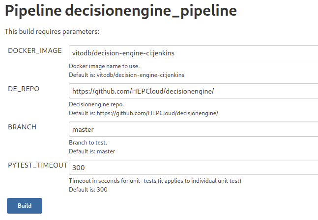

.. SPDX-FileCopyrightText: 2017 Fermi Research Alliance, LLC
.. SPDX-License-Identifier: Apache-2.0

Decisionengine CI with Jenkins pipeline
=======================================

Jenkins dashboard with Decisionengine framework CI results is available
`here <https://buildmaster.fnal.gov/buildmaster/view/CI/job/decisionengine_pipeline/>`_.

| A CI build is triggered any time a PR is created/closed or a commit is made to an existing PR.
| There are also `nightly CI builds`_ to test a list of predefined branches.

The Jenkins pipeline runs *pylint* and *unit_tests* test suites alongside the *rpmbuild* stage.

The Jenkins dashboard looks like this:

| On the bottom left side there is the list of recent CI builds that are named after the PR or the branch tested.
| On the bottom right side the dashboard shows for each CI build detailed status for each test suite.

Hovering the mouse over the *status box* for each CI build stage, a tool-tip with a button to access log details shows up.

Next to the build number the symbol |download_icon| gives access to a menu with the list of artifacts stored for that build.
Those artifacts include logs and the tarball with RPMs.

From the panel on the left side it is possible to access the PR on GitHub by clicking on the PR icon that looks like this |PR_icon|.

On occasion it could be useful to trigger a manual CI build to test a branch on the official DE GitHub repository or on the user fork.
For this purpose, on the top left panel the user can click on the |Build with Parameters| button, and this panel shows up

the user can modify these parameters to customize what code to test with the CI build.

| The *DE_REPO* parameter can point to the user fork or to the main repository.
| The *BRANCH* parameter can point to the desired branch to test.
| The *PYTEST_TIMEOUT* parameter is the timeout in seconds for *unit_tests*.

When ready, by clicking on the *Build* button, the CI build will start.

The `pipeline configuration <https://github.com/HEPCloud/decisionengine/blob/master/.Jenkinsfile/>`_ is part of the decisionengine repo.

.. _nightly CI builds:

Nightly CI build configuration
------------------------------

The nightly CI build for Decisionengine framework uses this `Jenkins project <https://buildmaster.fnal.gov/buildmaster/view/CI/job/decisionengine_ci/>`_ that triggers a CI build using the Jenkins pipeline described above to test a list of predefined branches.

|
| Branches to test are defined using the project matrix as shown in the picture below.
| Each branch in the list (here *master* and *1.4*) spawns an independent CI build.
|

|
| In the *Build* section of the configuration it is set the list of Jenkins subprojects to be triggered, in this case we have *decisionengine_pipeline* and *decisionengine_modules_pipeline*.
| The *Parameters* text box is used to override parameters of each Jenkins subproject with a custom value.
| In total this Jenkins project triggers 4 CI builds, i.e. 2 branches X 2 Jenkins subprojects.
|

|
| Finally the *Build Triggers* section is used to setup the schedule for the periodic build,
| in this case it is scheduled to run at about 2 AM.
| Jenkins will choose the actual time depending on the actual load on the system.
|

.. image:: jenkins_pic/DE_nightly_ci_build_schedule_cfg.png
